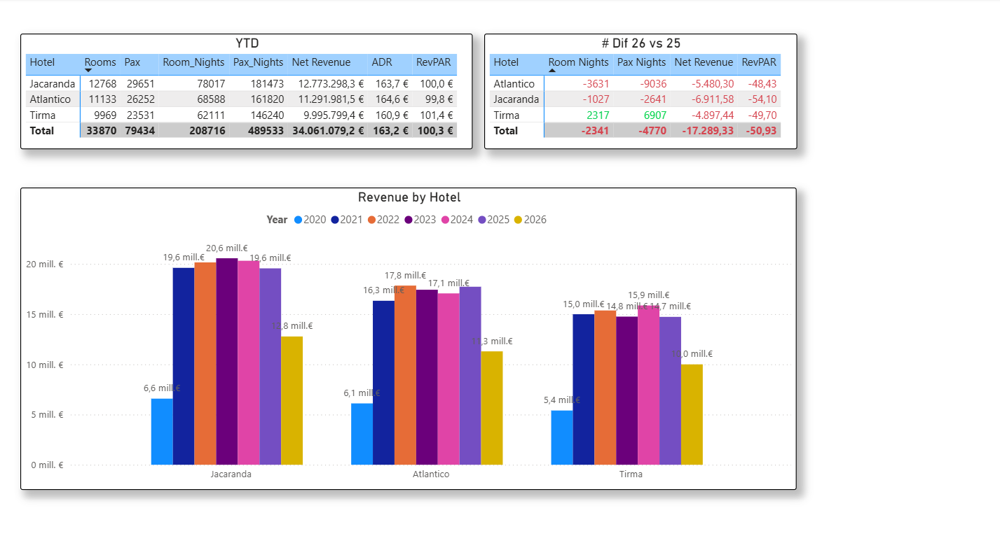
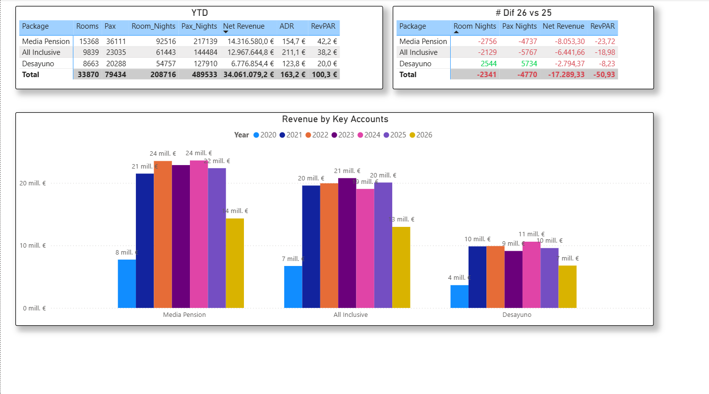

# 🏨 Hotel Revenue & Guest Intelligence Analytics

Pipeline completo y cuadro de mando ejecutivo en Power BI para el análisis de Revenue Management e Inteligencia de Cliente. Procesa y analiza el rendimiento comercial YTD (2026 vs 2025) con un volumen total de **34,06 Millones de €** y **208.716 noches ocupadas**.

---

## 📋 Contenido del Proyecto

* **ETL & Limpieza de Datos (Python):** Procesamiento, transformación y estructuración del dataset original mediante Pandas en Jupyter Notebook.
* **Modelo Dimensional & DAX Avanzado:** Modelo en estrella en Power BI con medidas dinámicas YTD para comparar periodos equivalentes ($01/01 \text{ al } 30/06$).
* **Dashboard Ejecutivo Interactivo:** Diseño UI/UX unificado para análisis visual de rendimiento.
* **Análisis de Distribución & Canales:** Rendimiento por canal (B2B, Directo, Web) y principales cuentas (Key Accounts).
* **Segmentación de Cliente:** Comportamiento por País de Origen, Tipo de Cliente (Nuevo vs Repetidor) y Franjas de Edad.
* **Análisis de Producto & Régimen:** Desglose por categorías de habitación (Standard, Superior, Suites) y paquetes/regímenes contratados.

---

## 📊 Resumen de Resultados (YTD 2026)

| Métrica | Valor |
| :--- | :--- |
| 💶 **Net Revenue Total** | 34.061.079,2 € |
| 🛌 **Room Nights Totales** | 208.716 noches |
| 👥 **Pax Nights Totales** | 489.533 noches |
| 🏷️ **ADR (Tarifa Media)** | 163,2 € |
| 🏨 **RevPAR** | 100,3 € |
| 📈 **Ocupación Media (% OCC)** | 91,7 % |
| 📊 **Hoteles Analizados** | 3 (Jacaranda, Atlantico, Tirma) |

---

## 📊 Visualizaciones Generadas

A continuación se muestran las principales vistas del cuadro de mando interactivo:

### 1. Dashboard Revenue General

### 2. Revenue Analytics & Evolución

### 3. Customer Analytics

### 4. Rendimiento por Hotel (YTD & # Dif 26 vs 25)

### 5. Análisis por Canal de Reserva (Booking Source)

### 6. Análisis por Cuentas Clave (Key Accounts)

### 7. Análisis por Régimen (Package)

### 8. Análisis FIT vs Group

### 9. Desglose de Tipos de Grupo

### 10. Categorías de Habitación (Room Type)

### 11. País de Origen del Huésped (Guest Country)

### 12. Tipo de Huésped (Nuevo vs Repetidor)

### 13. Franjas de Edad (Age Groups)

---

## 🔑 Hallazgos Clave

### 1. Auges del Canal Directo
* **Crecimiento:** **+4.768 noches** adicionales vs 2025.
* **Impacto:** La estrategia de venta propia está arrebatando volumen con éxito a los canales intermediados B2B.

### 2. Transición hacia Regímenes Flexibles
* **Alojamiento y Desayuno:** **+2.544 noches** vs 2025.
* **Media Pensión y All Inclusive:** Presentan ajustes a la baja, indicando una preferencia del cliente hacia ofertas más flexibles.

### 3. Desempeño por Mercados Emisores
* **España:** Mercado líder absoluto (**10,3 Mill. €** / **63.667 noches**) con saldo positivo (**+671 noches**).
* **Alemania:** Fuerte expansión comercial con **+1.722 noches** adicionales (**+5.140 Pax Nights**).
* **Reino Unido:** Principal mercado con ajuste negativo (**-3.273 noches**).

### 4. Demografía y Franjas de Edad
* **Motor del crecimiento:** La franja de **36-50 años** lidera la recuperación con **+2.685 noches** vs 2025.
* **Retención de jóvenes:** Ligero descenso en el volumen de huéspedes entre 18 y 35 años (**-6.233 noches** en total para el segmento).

---

## 📈 Rendimiento YTD por Canales y Cuentas Clave

### Top Canales por Revenue (2026)

| Booking Source | Room Nights (YTD) | Net Revenue (YTD) | Dif Noches (26 vs 25) |
| :--- | :--- | :--- | :--- |
| **B2B** | 93.134 | 14.839.354,6 € | -4.022 |
| **Web** | 69.135 | 11.586.709,1 € | -3.087 |
| **Direct** | 46.447 | 7.635.015,6 € | **+4.768** |

### Top Key Accounts por Revenue

| Cuenta | Revenue YTD | Room Nights | ADR | Dif Noches (26 vs 25) |
| :--- | :--- | :--- | :--- | :--- |
| 🥇 **Booking.com** | 8.172.265,3 € | 49.121 | 166,4 € | **+3.039** |
| 🥈 **TUI Group** | 6.516.750,5 € | 40.211 | 162,1 € | -2.669 |
| 🥉 **Jet2holidays** | 5.015.281,3 € | 30.525 | 164,3 € | -401 |
| **Schauinsland-Reisen**| 3.262.353,5 € | 20.275 | 160,9 € | -1.342 |
| **Hotelbeds** | 2.785.531,4 € | 17.894 | 155,7 € | **+502** |

---

## 👥 Segmentación Demográfica del Huésped

| Franja de Edad | Room Nights | Net Revenue | Dif Noches (26 vs 25) | Perfil |
| :--- | :--- | :--- | :--- | :--- |
| **36-50** | 69.536 | 11.442.572,6 € | **+2.685** | 🏆 Principal motor de crecimiento |
| **51-65** | 48.166 | 7.592.844,4 € | **+686** | 📈 Segmento estable y rentable |
| **26-35** | 45.066 | 7.643.014,7 € | -3.020 | 📉 Ajuste en viajes jóvenes |
| **65+** | 25.614 | 4.152.710,6 € | **+521** | 👵 Crecimiento constante senior |
| **18-25** | 20.334 | 3.229.937,0 € | -3.213 | ⚠️ Segmento con mayor reducción |

---

## 🛠️ Tecnologías Utilizadas

* **Python:** `Pandas`, `NumPy` (Limpieza, tratamiento de datos y exportación a CSV).
* **Power BI Desktop:** Power Query, Modelado dimensional en estrella, **DAX avanzado** (`CALCULATE`, `ALL`, `REMOVEFILTERS`, `DATESBETWEEN`).
* **Git / GitHub:** Documentación y control de versiones del proyecto.

---

## 🛠️ Tecnologías Utilizadas

* **Python:** `Pandas`, `NumPy` (Limpieza, tratamiento de datos y exportación a CSV).
* **Power BI Desktop:** Power Query, Modelado dimensional en estrella, **DAX avanzado** (`CALCULATE`, `ALL`, `REMOVEFILTERS`, `DATESBETWEEN`).
* **Git / GitHub:** Documentación y control de versiones del proyecto.
